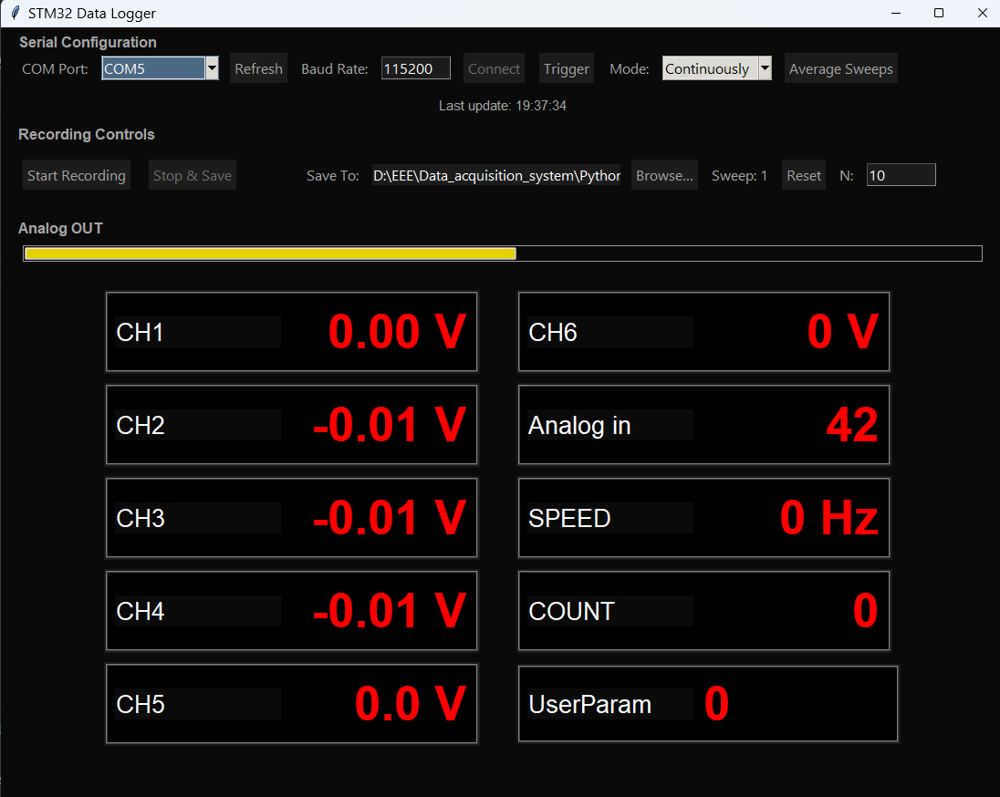

# Data-acquisition-system-using-stm32
Data acquisition system based on microcontroller stm32F1(Blue pill) 
**STM32 Multi-Channel Data Acquisition & Visualization System**

---

## About
In this project STM32 microcontroller is used to take multiple readings and show it to the user via inbuilt display and on the PC software. The data can also be recorded in excel file for further processing and visualization. It makes it very useful when some one want to record multiple readings and multiple times. Like this V-I characteristics of 3mm LEDs obtained with this system:

---
### Features
 **1. Inputs:**
                CH1 to CH4 : DC voltage upto ± 20v
                CH5 : DC voltage upto ± 40v
                CH6 : DC voltage upto ± 100v
                Analog in : directly displays analog reding (0 to 4096) in range ± 1.65v
                Speed : It takes pulse input to count number of pulses and speed

  
**2. Output:**  
              Analog out : Generates ramp voltage output ( -1.65v to +1.65v ) for scaning/sweeping purpose.

**3. Reading modes/Functions:**  
     Function 1 : Sends one set of reading from all inputs to the PC when trigger button is pressed. 
     Function 2 : Start sending readings from all inputs continuously at predefined intervals(TimeBase) when trigger button is pressed. 
     Function 3 : When trigger is pressed it sends 240 readings at predefined intervals(TimeBase) while Analog out goes to +1.65v from -1.65v. 

**4. User buttons:**  
    Different settings can be changed using "Menu", "Up" and "Down" button. Settings like: which reading mode to be used, TimeBase selection, What to display on the inbuilt display, etc.

**5. PC GUI Software:**
  

  
  

  * Serial connection interface
  * Trigger button (working same as the trigger button on the device).
  * Mode selection: There are two modes "Continuous", "Sweep". In the "continuous" mode continuously data is pushed into the excel file. In "Sweep" mode, one sweep is considered when analog out goes from -1.65v to +1.65v (internaly PWM goes from 0 to 240). And each sweep is recoreded in separate sheet of same file. In this mode, when recording is on and trigger is pressed, it will record N sweeps. Additionly there is an average button that can be used to take average of the corresponding values from all sheet and store in a separate sheet.
  * Analog out progrees bar: It gives a visual representation of the instantaneous output voltage.
  * Reading display: Readings are displayed with default lables(CH1,CH2,...). These lables can be changed if requared. An UserParam is also given so that user can input values that needs to be included in the excel. 
  

---
### Some data obtained with this setup 
- **V-I characteristic of 3mm LEDs:** [steps](https://github.com/Ritik440/Data-acquisition-system-using-stm32/blob/main/exp1.txt) 
  

  
  

---

## Construction

### 1. Hardware Details
- **The microcontroller:** STM32F103C8T6 "Blue Pill" is used as MCU. It has 32bit processor with 64kB of FLASH and 20kB of SRAM having 12bit ADC.
- **Analog Inputs:** PA0–PA5 wired to the external connector with appropriate voltage divider. 0.1uF capacitor is connected between each ADC pin and ground to suppress the loading of voltage divider by internal sampling capacitor.   
- **Display Wiring:** Onboard 4 digit 7-segment display is controlled by port B using multiplexing. An additional red LED is used to indicate negative values on the display. This additional LED is connected in parallel with the inbuild decimal led of rightmost digit(which is painted with black from outside). The decimal led of rightmost digit is unused in most cases that`s whyt this done so that no any additional pin is used just to display negative values    
- **Buttons:** Buttons are connected to the interrupt pins with pull down resistors. 0.1uF connected capacitor suppress the debouncing effect.  
- **Referance voltage** As MCU can read from 0v to 3.3v, to read negative voltages a reference of 1.65v is generated with the help of voltage divider between 0v rail and 3.3v rail and a buffer using LM324.    
- **Analog Output** Digital pin PA7 is configured to generate PWM pulses which is then passed to a low pass filter, generating voltage voltage between 0v and 3.3v ( -1.65 to +1.65 with respect to Vref). 

### 2. [Firmware](https://github.com/Ritik440/Data-acquisition-system-using-stm32/blob/main/DAQ_V8_Serial.ino)

### 3. [Python GUI](https://github.com/Ritik440/Data-acquisition-system-using-stm32/blob/main/DAQ.py)

---

## Conclusion

This system delivers a cost-effective, customizable data acquisition platform combining:
- **Real-time on-board display** for immediate feedback.  
- **High-speed USB streaming** for extensive logging.  
- **User-friendly PC application** for analysis and visualization.  

Ideal for educators, hobbyists, and prototype developers seeking a flexible DAQ solution without commercial hardware costs.
